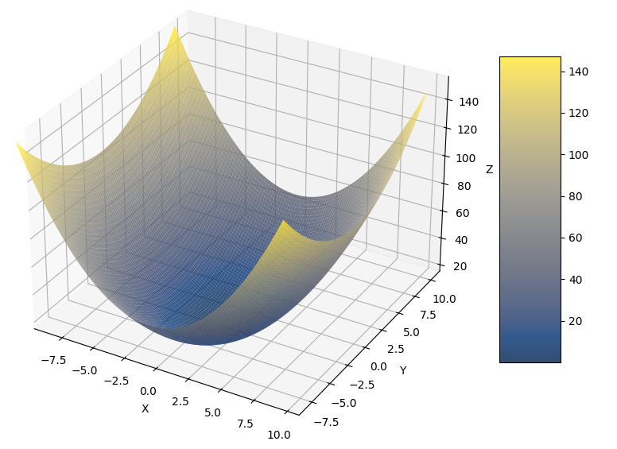

# Optimization Course IMA-314

Welcome to the repository for the Optimization Course IMA-314! This course covers fundamental concepts and techniques in optimization, focusing primarily on first-order and second-order optimization methods.

### Course Overview

In this course, we will explore various optimization algorithms, including:

- **Gradient Descent (GD)**: A first-order iterative optimization algorithm for finding a local minimum of a differentiable function.
- **Nesterov Gradient Descent (NGD)**: An enhanced version of GD that incorporates a momentum term to improve convergence speed and accuracy.
- **Subgradient Method**: A generalization of gradient descent for non-differentiable functions, allowing optimization in broader contexts.
- **Adagrad**: An adaptive learning rate method that adjusts the learning rate based on the parameters.
- **RMSProp**: A modification of Adagrad that helps mitigate the rapid decay of the learning rate.
- **Adam**: Combines the advantages of both Adagrad and RMSProp, using moments to enhance convergence. 


## Getting Started
  <!-- Replace with a relevant GIF URL -->

To get started with the course materials and exercises, clone this repository:

```bash
git clone https://github.com/Harshtherocking/Optimization-IMA-314/tree/main
cd Optimization-IMA-314/

python3 -m venv virtualenv

source virtualenv/bin/activate
pip install -r requirement.txt
```

## Example
Command :
```python
# declare a funciton 
f = lambda x : x[0] ** 2  +  x[0]*x[1]  + x[1] ** 2

# pass into Funtion object
sampleFunc = Function (f, name = "samplefunc")

# plot the function
sampleFunc.plot()
```

Output :


Command : 
```python
# get value for a specific point
x = np.array([5,2])

func_val = sampleFunc(x)
grad_val = sampleFunc.grad(x)
hess_val = sampleFunc.hessian(x)

print(f"At {x}\nF(x) = {func_val}\nG(x) = {grad_val}\nH(x) = {hess_val}")
```

Output : 
```console
At [5 2]
F(x) = 39
G(x) = [11.99999993  9.00000003]
H(x) = [[71.05427358  0.]
 [ 0. 0.]]
```

Command : 
```python
# define optimization algorithms
gs = GoldenSearch () 
gd = GradientDescent (alpha = 0.01, alpha_optim = gs)

# optimize and plot trajectory
x = np.array([7,10])
soln = sampleFunc.optimize (x, optim= gd, is_plot = True)
print(f"Optimize x : {soln}")
```

Output : 
```console
Optimize x : [-2.40197597e-05  3.90572496e-05]
```

## Contributing

Feel free to contribute by submitting issues or pull requests. We welcome any improvements, suggestions, or additional resources!

## License

This project is licensed under the MIT License. See the LICENSE file for details.

---
