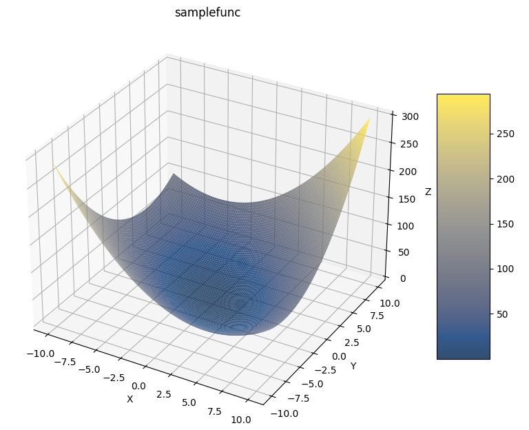
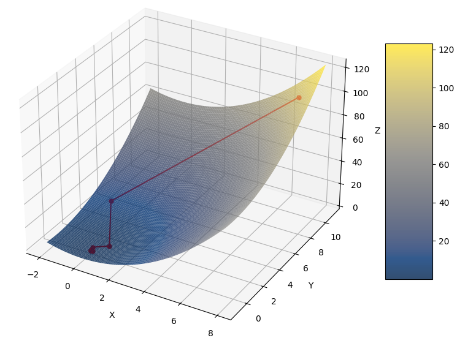

Optimization IMA-314
=====================

Welcome to the repository for the Optimization Course IMA-314! This course covers fundamental concepts and techniques in optimization, focusing primarily on first-order and second-order optimization methods.

Directory Structure
-------------------

The repository contains several utility files organized in the ``./algorithms/`` directory, each serving specific functionalities related to optimization:

- **Base Utilities**
  - ``base.py``: Base classes for:
    - Optimizer
    - Functions
    - Algorithms

- **First-Order Optimization Algorithms**
  - ``first_order.py``: Implementations of:
    - Gradient Descent
    - Nesterov Gradient Descent
    - RMSProp
    - Adagrad
    - Adam
    - Subgradient

- **Second-Order Optimization Algorithms**
  - ``second_order.py``: Implementations of:
    - Newton's Method
    - BFGS
    - DFP
    - Conjugate Gradient

- **Line Search Methods**
  - ``line_search.py``: Implements:
    - Golden Section
    - Backtracking

- **Regression Implementations**
  - ``regression.py``: Includes:
    - Linear Regression
    - Logistic Regression

- **Benchmark Functions**
  - ``functions.py``: Provides functions such as:
    - Piecewise Linear
    - Rosenbrock

Getting Started
---------------

To get started with the course materials and exercises, clone this repository:

.. code-block:: bash

   git clone https://github.com/Harshtherocking/Optimization-IMA-314/tree/main
   cd Optimization-IMA-314/

   python3 -m venv virtualenv

   source virtualenv/bin/activate
   pip install -r requirements.txt

Example
-------

Command:

.. code-block:: python

   # import everything
   from algorithms import * 

   # declare a function 
   f = lambda x : x[0] ** 2 + 0.5 * x[1] ** 2

   # pass into Function object
   sampleFunc = Function(f, name="samplefunc")

   # plot the function
   sampleFunc.plot()

Output:

Command:

.. code-block:: python

   # get value for a specific point
   x = np.array([5, 2])

   func_val = sampleFunc(x)
   grad_val = sampleFunc.grad(x)
   hess_val = sampleFunc.hessian(x)

   print(f"At {x}\\nF(x) = {func_val}\\nG(x) = {grad_val}\\nH(x) = {hess_val}")

Output:

.. code-block:: console

   At [5 2]
   F(x) = 27.0
   G(x) = [10.  2.]
   H(x) = [[2.0001778  0.]
    [0.        0.99831254]]

Command:

.. code-block:: python

   # define optimization algorithms
   gs = GoldenSearch()
   gd = GradientDescent(alpha=0.01, alpha_optim=gs)

   # optimize and plot trajectory
   x = np.array([7, 10])
   soln = sampleFunc.optimize(x, optim=gd, is_plot=True)
   print(f"Optimize x : {soln}")

Output:

.. code-block:: console

   Optimize x : [2.80677703e-05 3.93062445e-05]

Contributing
------------

Feel free to contribute by submitting issues or pull requests. We welcome any improvements, suggestions, or additional resources!

License
-------

This project is licensed under the MIT License. See the LICENSE file for details.

---

**In mathematics the art of proposing a question must be held of higher value than solving it.**
